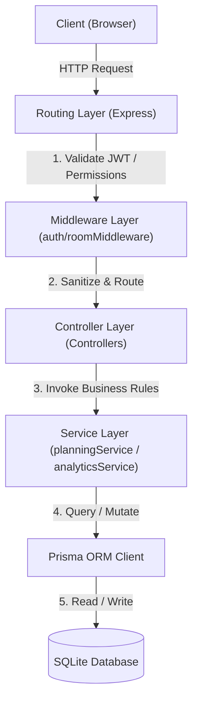
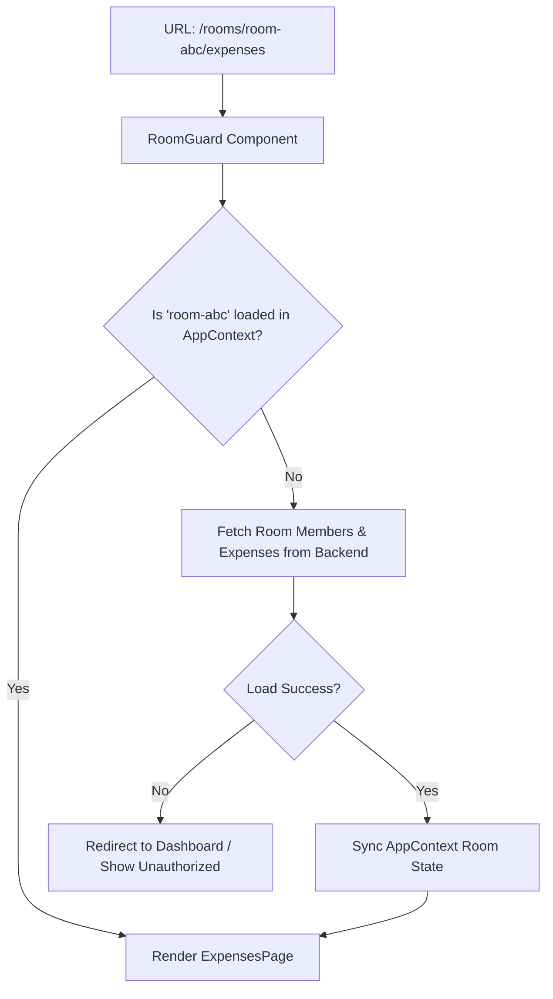
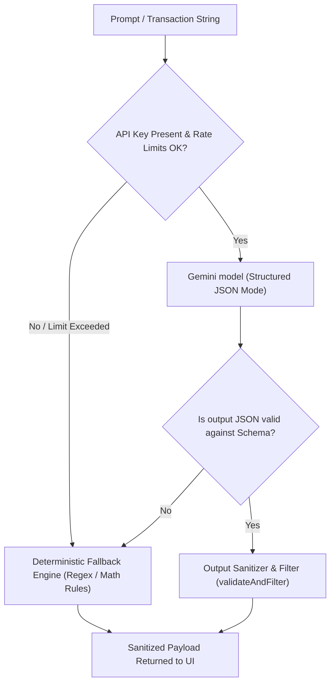

# SplitEasy — Full Project Architecture & Product Audit Report

SplitEasy is a premium, context-aware, privacy-first personal financial management and group expense splitting application. The system has been architected to handle complex transaction splits, track multi-scoped budgets, manage multi-user group ledgers, and provide tailored AI-driven planning and insights.

---

## 1. What is this Application?

SplitEasy resolves key friction points in group dynamics and personal finance tracking:
* **The Problem**: Splitting bills with unequal shares, tracking multi-group balances without cross-contamination, setting room-specific monthly budgets, establishing financial forecasts, and parsing natural language receipts are highly error-prone when done manually.
* **The Value Proposition**: A unified personal financial dashboard combined with robust group-splitting "rooms" that maintains perfect mathematical integrity, models user behavior safely, protects privacy, and uses Google Gemini to generate contextual plans and parse colloquial Vietnamese text.
* **Target Users**: Roommates sharing recurring household utility costs; traveler groups planning itineraries and dividing trip expenditures; event planners managing exact/percentage budget limits; and personal finance advocates seeking visual analytics, daily velocity indicators, and anomaly notifications.

---

## 2. What Features Currently Exist?

SplitEasy contains a mature feature grid split between the **Personal Intelligence Hub** and the **Multi-User Room Engine**:

### A. Personal Intelligence Hub
* **Unified Dashboard**: Standalone dashboard ([PersonalDashboard.jsx](file:///c:/Users/Admin/Desktop/abcxyz/c/src/pages/PersonalDashboard.jsx)) that aggregates active rooms count, net balances, current-month expenditures, and recent multi-room transactions without manual calculations.
* **Advanced Financial Analytics**: Built-in processor ([analyticsService.js](file:///c:/Users/Admin/Desktop/abcxyz/c/backend/services/analyticsService.js)) tracking daily spending speed (**Spending Velocity**), monthly trends, category concentrations, and room contributions.
* **Intelligent Forecasting**: Extrapolates current monthly expenditures using a weighted combination of month-to-date daily averages and 3-month historic moving averages, complete with bounded confidence scores and explicit mathematical assumptions.
* **Recurring Expense Detector**: Groups user-scoped transaction logs by normalized titles and categories to automatically infer active subscriptions or recurring payments (weekly, monthly, or irregular) with a confidence score based on cadence regularity and amount variance.
* **Real-time Anomaly Engine**: Scans active transactions for category-specific spending spikes, large transaction discrepancies (deviations > 2.5x current average), room expense spikes, or worsening net-debt positions.
* **AI Financial Coach**: Contextual advisory panel ([InsightsSection.jsx](file:///c:/Users/Admin/Desktop/abcxyz/c/src/components/personal/InsightsSection.jsx)) powered by Google Gemini that generates up to 5 concise, Vietnamese-language insights mapped to the user's inferred habits, forecast risks, and anomalies.

### B. Multi-User Room Engine
* **Flexible Transaction Splits**: Supports Equal Splitting, Exact Amount Splitting, and Percentage-Based Splitting with backend-enforced assertions checking that fractions balance to the exact cent/VND.
* **Optimized Debt Settlements**: Resolves circular group debts into a minimized set of bilateral payments using a zero-sum net-balance pathfinder ([settlement.js](file:///c:/Users/Admin/Desktop/abcxyz/c/backend/utils/settlement.js)).
* **Secure Guest Member Claims**: Allows rooms to include virtual guest profiles. If a real user joins, they can claim the guest's ledger, merging past balances into their account while the system automatically releases claimed identities back to active if the claiming member is ejected ([roomController.js](file:///c:/Users/Admin/Desktop/abcxyz/c/backend/controllers/roomController.js)).
* **Dual-Scoped Budgeting**: Tracks monthly spending categories against budgets mapped either to a single User or to a shared Room context, reporting over-budget metrics and at-risk alerts.
* **Colloquial AI Parser**: Real-time Vietnamese natural language expense parsing ([parser.js](file:///c:/Users/Admin/Desktop/abcxyz/c/backend/services/ai/parser.js)) supporting shorthand notations (e.g., *1tr2*, *1 triệu*, *100k*, *1 củ*) and collective pronouns (*tôi*, *mình*, *cả nhà*, *anh em*).
* **AI Planning Board**: Generates detailed itineraries and cost estimates ([planGenerator.js](file:///c:/Users/Admin/Desktop/abcxyz/c/backend/services/ai/planGenerator.js)) based on trip or event parameters, offering user-interactive, modular expense additions, cost editing, and single-click conversion from planned items into real Room expenses.

---

## 3. What Technologies Are Used?

```
┌────────────────────────────────────────────────────────────────────────┐
│                          Core Technology Stack                         │
├───────────────────┬────────────────────────────────────────────────────┤
│                   │ • React 18 & Vite (Fast HMR & build bundling)      │
│                   │ • Framer Motion (Glassmorphism card animations)    │
│ Frontend Core     │ • Tailwind CSS (Curated dark-mode design system)   │
│                   │ • Lucide React (Premium iconography system)        │
│                   │ • Chart.js / Recharts (Responsive charts)          │
│                   │ • Axios (API Client with dynamic interceptors)     │
├───────────────────┼────────────────────────────────────────────────────┤
│                   │ • Node.js & Express (Layered architecture)         │
│ Backend Server    │ • Prisma ORM (Type-safe DB migration/query schema) │
│ & Databases       │ • SQLite (Single-write speed for local & testing)  │
│                   │ • BcryptJS (Credential hashing)                    │
│                   │ • JSON Web Tokens (Session authentication state)   │
├───────────────────┼────────────────────────────────────────────────────┤
│ AI & LLM Systems  │ • Google Gen AI SDK (@google/genai)                │
│                   │ • Gemini 2.5 Flash (Contextual plans / insights)   │
├───────────────────┼────────────────────────────────────────────────────┤
│ Testing &         │ • Vitest (Fast ESM-native runner)                  │
│ Runtime           │ • Supertest (Declarative REST endpoint asserts)    │
│ Operations        │ • PM2 (Fork process management with RAM safety)    │
│                   │ • Nginx (Reverse proxying and secure HTTPS SSL)   │
└───────────────────┴────────────────────────────────────────────────────┘
```

---

## 4. What Architecture Patterns Are Used?

### A. Layered Backend Architecture
The backend is structured into rigid, isolated layers to prevent leakage of controller logic into routing tables:
1. **Routing Layer**: Receives HTTP verbs, binds route-level limiters, and attaches role authentication checks ([roomRoutes.js](file:///c:/Users/Admin/Desktop/abcxyz/c/backend/routes/roomRoutes.js)).
2. **Middleware Layer**: Enforces JWT identity extraction, checks room scope parameters, and parses resource ownership rights ([roomMiddleware.js](file:///c:/Users/Admin/Desktop/abcxyz/c/backend/middleware/roomMiddleware.js)).
3. **Controller Layer**: Sanitizes input parameters, handles request response flows, and catches synchronous/asynchronous errors ([guestController.js](file:///c:/Users/Admin/Desktop/abcxyz/c/backend/controllers/guestController.js)).
4. **Service Layer**: Houses core business actions like financial profile regeneration, AI plan calculation, and budget-to-expense comparison ([personalFinanceProfileService.js](file:///c:/Users/Admin/Desktop/abcxyz/c/backend/services/intelligence/personalFinanceProfileService.js)).
5. **Database Access Layer**: Interacts with tables via [Prisma Client](file:///c:/Users/Admin/Desktop/abcxyz/c/backend/utils/db.js).



### B. Client Routing & Room Guard Architecture
To enable seamless browser refresh (F5 support) and deep linking without state loss, SplitEasy mounts a reactive `<RoomGuard>` pattern:
* Dynamic routes capture parameters, e.g. `/rooms/:roomId/*`.
* The guard extracts `roomId`, checks member access rights, loads the target room context, and synchronizes React states.
* It wraps internal components, rendering fallback placeholders or access-denied warnings to prevent blank screen crashes.



### C. Hybrid AI & Deterministic Architecture
Both AI NLP parsing and insights generation use a dual-path design:
1. **The Fast/Deterministic Path (Fallback)**: If the Gemini client is missing its API key, hits rate limits, or fails validation schema parses, the system falls back to strict local modules ([fallback.js](file:///c:/Users/Admin/Desktop/abcxyz/c/backend/services/ai/fallback.js) and [insightRules.js](file:///c:/Users/Admin/Desktop/abcxyz/c/backend/utils/insightRules.js)) that run localized regex patterns or statistical analytics to yield valid JSON structures immediately.
2. **The Smart/AI Path**: Feeds the Gemini model structured data combined with privacy-masked context arrays to guarantee highly creative suggestions while keeping sensitive identities hidden.



---

## 5. What Systems Are Already Mature & Stable?

* **Mathematical Split Ledger**: Core calculations in [settlement.js](file:///c:/Users/Admin/Desktop/abcxyz/c/backend/utils/settlement.js) and [calculations.js](file:///c:/Users/Admin/Desktop/abcxyz/c/src/utils/calculations.js) ensure zero-sum invariants, floating-point drift elimination, and exact split matches across user/guest balances.
* **Security & Room Access Isolation**: Middleware checks prevent users in Room A from inspecting or editing transactions in Room B, even when manually changing URL route IDs.
* **Guest Management Security**: Prevents identity hijacking by rejecting double claims of the same guest, locking displayName changes on claimed profiles, and automatically releasing claimed states back to active if a user is kicked from the room context.
* **Deterministic Fallback NLP Engine**: Easily parses colloquial Vietnamese amounts (e.g. *1.2tr*, *500k*) and group pronouns (*tôi*, *mình*, *cả nhóm*) with zero external network lag.
* **Hardened API Infrastructure**: Robust limits on JSON request payloads (100kb), secure CORS origin validations, helmet security configurations, and modular express-rate-limiters prevent typical production exploits (brute force, DDoS, JSON overflows).

---

## 6. What Systems Are Still Incomplete?

* **Persisted Rollups / Aggregates**: Personal analytics currently process all historical rows at request time. While efficient for moderate scales, this must shift to daily database rollups or materialized caching for highly active multi-year ledgers.
* **Advanced Seaonality Models**: Current monthly forecasting assumes simple linear daily speeds and historic moving averages; it has no understanding of annual holiday cycles, month-end payroll spikes, or custom budget targets.
* **Granular AI Plan Item Splits**: AI plan creation generates itemized lists with even splits. The system currently lacks a UI to define exact custom participant shares directly *during* AI Generation (users must update these manually after plan item conversion).
* **Fuzzy Title Matching for Recurring Bills**: Recurring candidate detection relies on strict case-insensitive exact string match. Variations in title (e.g. *Tiền nước* vs *Tien Nuoc T5*) are treated as separate items.

---

## 7. What Technical Debt Exists?

* **Vite Circular Vendor Chunk Warnings**: The React client compilation outputs warnings regarding circular dependencies within standard package modules. While not impacting execution, this increases browser payload chunks.
* **SQLite Write Locks under High Scale**: The SQLite backend is excellent for single-process operations but remains vulnerable to write-lock queue wait-states under highly concurrent concurrent user spikes (highly recommended to migrate to Postgres/MySQL for production deployments).
* **In-Memory Cache Lacks Instant Eviction Hooks**: AI financial insights are cached in-memory for 5 minutes to prevent Gemini key exhaust. However, this cache is not instantly invalidated when users add large expenses, meaning insights may lag slightly behind immediate transactions.
* **Lack of Complete End-to-End Viewport Test Coverage**: While backend services and calculations have thorough Vitest coverage, there is no automated viewport harness (Cypress/Playwright) to verify mobile drawer layouts or gesture clicks.

---

## 8. What AI Systems Exist?

SplitEasy integrates three distinct Google Gemini 2.5 Flash workflows:

### A. Context-Aware AI Plan Generator
* **File Location**: [planGenerator.js](file:///c:/Users/Admin/Desktop/abcxyz/c/backend/services/ai/planGenerator.js)
* **Design**: Consumes user inputs (destination, length, preferences) along with a serialized, privacy-masked profile context.
* **Privacy Masking**: The user's finance traits are serialized via [profileSerializer.js](file:///c:/Users/Admin/Desktop/abcxyz/c/backend/services/intelligence/profileSerializer.js) into anonymous descriptive lines (e.g., *Spending Volatility: low*, *Spending Style: balanced*). It strips emails, passwords, absolute currency totals, names, and identifiers before sending data to Gemini.
* **Output**: Returns a strict, structured JSON scheme containing estimated item costs, recommended categories, and risk warnings.

### B. Natural Language Vietnamese Expense Parser
* **File Location**: [parser.js](file:///c:/Users/Admin/Desktop/abcxyz/c/backend/services/ai/parser.js)
* **Design**: Captures Vietnamese messages describing group expenses, translating colloquial terms into structured transaction items.
* **Output**: Extracts title, category, integer VND amounts, and candidate payer/participants.

### C. Personal Insights Engine
* **File Location**: [insightGenerator.js](file:///c:/Users/Admin/Desktop/abcxyz/c/backend/services/ai/insightGenerator.js)
* **Design**: Synthesizes the personal summary data, monthly spending forecasts, velocity trackers, budget health limits, and anomaly arrays.
* **Constraints**: Hardcapped at 5 concise, actionable Vietnamese insights (max 40 words each), completely avoiding investment, legal, or health claims, and mapping confidence metrics between 0 and 1.

---

## 9. What Security Systems Exist?

SplitEasy has been designed around a secure-by-default architecture:
* **Anti-Enumeration Handlers**: The forgot-password flow ([authController.js](file:///c:/Users/Admin/Desktop/abcxyz/c/backend/controllers/authController.js)) returns a generic success message (*"If email exists, reset link sent"*), preventing attackers from enumerating registered users.
* **One-Way Cryptographic Reset Tokens**: Password resets use high-entropy random hex tokens. These are hashed using SHA-256 before being saved to the database. If the DB is leaked, reset tokens remain secure.
* **Strict JWT Session Authorization**: Sessions are secured via JWT tokens passed in authorization headers, mapped dynamically to `req.user` payload entries ([authMiddleware.js](file:///c:/Users/Admin/Desktop/abcxyz/c/backend/middleware/authMiddleware.js)).
* **Multi-Layered Rate Limiters**: 
  - `generalLimiter`: Capped at 300 requests/15 mins.
  - `authLimiter`: Capped at 20 login/register requests/15 mins (mitigates brute-forcing).
  - `aiLimiter`: Capped at 20 requests/1 min (prevents billing abuse).
* **AI Leakage Prevention Filters**: Excludes all raw transaction lists, email credentials, or database keys from prompts, passing only high-level aggregates and anonymous metadata labels to Gemini.
* **Dual-Check Guest Protections**: Validates guest identities before allowing owners to approve claims, preventing hijacking, double claims, or orphaned ledger fragments.

---

## 10. What Deployment Systems Exist?

The production environment is engineered to run reliably on an Ubuntu 22.04 LTS VPS (1 vCPU, 1 GB RAM) using a microservice deployment pattern:
* **Static Asset Delivery**: Vite builds resources into the `/dist` directory (`VITE_API_BASE_URL=/api npm run build`). Express serves `/dist` statically ([app.js](file:///c:/Users/Admin/Desktop/abcxyz/c/backend/app.js)), supporting SPA clients with an fallback catch-all handler returning `index.html`.
* **PM2 Process Control**: Configured in [ecosystem.config.js](file:///c:/Users/Admin/Desktop/abcxyz/c/ecosystem.config.js) under single-process `fork` execution mode to prevent concurrent SQLite write-lock blocks.
* **Memory Safety Controls**: Implements `max_memory_restart: '300M'` to prevent typical memory leak issues on small 1GB instances, restarting the process automatically if it breaches memory bounds.
* **Automated Recovery**: PM2 is configured to restore server operations instantly on unexpected host reboots (`pm2 startup` & `pm2 save`).
* **Secure Reverse Proxying**: Nginx routes standard web requests (Port 80/443) to local Port 5000, enforcing gzip compression, secure request proxy headers, and automated Let's Encrypt SSL HTTPS encryption via Certbot.

---

## 11. What Testing Systems Exist?

SplitEasy maintains high trust levels via its ESM-native **Vitest** automation suites:
* **Financial Integrity Tests** ([financeIntegrity.test.js](file:///c:/Users/Admin/Desktop/abcxyz/c/backend/tests/financeIntegrity.test.js)): Asserts that all room balance variations sum to exactly zero (zero-sum invariant), checks for floating-point drift under repetitive multi-split calculations, and ensures null fields or sparse participant parameters do not crash the engine.
* **AI NLP Parser Verification** ([aiParser.test.js](file:///c:/Users/Admin/Desktop/abcxyz/c/backend/tests/aiParser.test.js)): Tests the Vietnamese natural-language regex fallback rules against real slang (e.g. *Cafe 250k*, *ăn lẩu hết 1tr*, *vé xe 600k*, *khách sạn 1tr2*) and collective pronouns.
* **AI Context Privacy Tests** ([aiPrivacy.test.js](file:///c:/Users/Admin/Desktop/abcxyz/c/backend/tests/aiPrivacy.test.js)): Asserts that the serialized context provided to Gemini contains no emails, tokens, password hashes, or identifying labels.
* **Guest Claims Security Tests** ([guestClaim.test.js](file:///c:/Users/Admin/Desktop/abcxyz/c/backend/tests/guestClaim.test.js)): Verifies that already-claimed guests are locked from new claim requests and double claims are rejected with an HTTP 409 status.
* **API Hardening Tests** ([productionHardening.test.js](file:///c:/Users/Admin/Desktop/abcxyz/c/backend/tests/productionHardening.test.js)): Verifies helmet header configurations, rate limit responses (HTTP 429), and large payload rejections (HTTP 413).

---

## 12. What Product Direction is this App Evolving Toward?

SplitEasy is actively evolving from a basic group-ledger tool into a comprehensive, AI-enhanced personal financial companion:
1. **Context-Aware Financial Optimization**: Tailoring expenses based on behavioral styles inferred directly from past transaction categories.
2. **Predictive Budget Alerts**: Moving from passive category tracking to proactive notifications that predict when a user will breach a budget threshold days before it occurs.
3. **Seamless Planning-to-Ledger Pipelines**: Helping travelers plan trips with AI, modify estimates, track participants, and seamlessly convert travel items into real bills.
4. **Data Portability**: Empowering users to export complete room settlement and personal data portfolios to open formats (CSV/Excel) for custom spreadsheet modeling.
